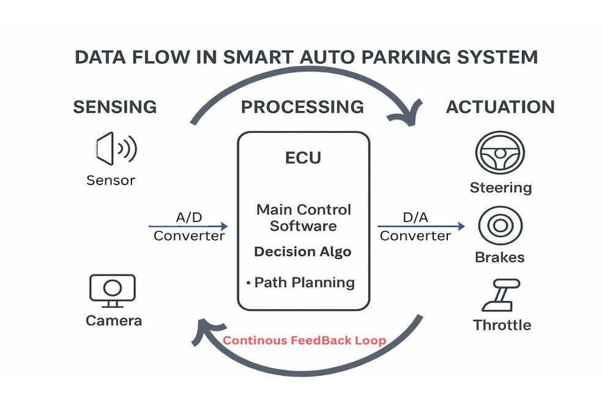
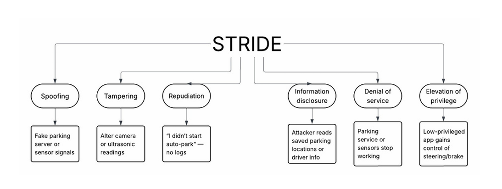
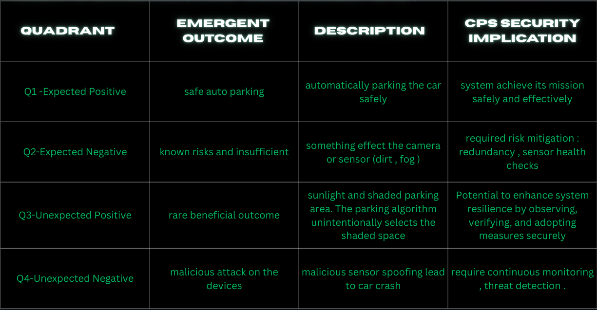

# 🚗 Project 1 — Smart Auto Parking CPS Security & Safety

## 📌 Project Overview
This project analyzes the **Smart Auto Parking System (APS)** as an Automotive Cyber-Physical System (CPS) with focus on safety, security, and system resilience.

The project studies how cyber components (software, decision algorithms), physical components (sensors, actuators), and communication networks (CAN bus, ECU communication) interact to perform safe autonomous parking while resisting cyber and safety threats.

The work combines CPS architecture design, threat modeling, risk analysis, and secure system improvement strategies.

---

## 🎯 Project Objectives
- Analyze CPS layered architecture (Physical, Communication, Cyber)
- Identify safety-critical components
- Perform CPS threat modeling using STRIDE
- Analyze emergent system risks using Emergence Matrix
- Propose secure CPS architecture improvements
- Apply CPS security engineering best practices

---

## 🧠 CPS Architecture Overview

The Auto Parking System is implemented as a closed-loop cyber-physical system consisting of:

### Physical Layer
- Cameras (Front / Rear / 360°)
- Ultrasonic Sensors
- Radar Sensors
- Brake Actuators
- Steering Motor
- Throttle Control
- Gear Selector Motor

### Communication Layer
- CAN Bus (vehicle communication backbone)
- Gateway ECU (message filtering and routing)
- Sensor communication channels

### Cyber Layer
- Main Parking Control Software
- Embedded Real-Time Operating System (RTOS)
- Decision Engine (Sensor Fusion + Path Planning)
- Secure Logging and Data Storage

---

## 🔄 CPS System Flow

The system operates using a continuous cyber-physical feedback loop.  
Sensors collect real-time environmental data which is processed by the ECU and decision engine.  
The decision engine generates safe control commands for actuators such as steering, braking, and throttle control.  

This loop ensures real-time safe parking behavior and accurate vehicle positioning.

---

## ⚠ Safety-Critical Components

Key components whose failure may cause accidents include:
- Sensors (distance and environment detection)
- Cameras (visual decision input)
- Brake and steering actuators
- CAN communication network
- ECU decision software

Safety mechanisms include redundancy, validation checks, fail-safe modes, and monitoring.

---

## 🛡 STRIDE Threat Modeling

The STRIDE framework was used to identify cyber threats affecting the Auto Parking CPS:

| Threat | Example Risk |
|---|---|
| Spoofing | Fake sensor signals |
| Tampering | Modified sensor data |
| Repudiation | Missing system logs |
| Information Disclosure | Data leakage |
| Denial of Service | Sensor / network flooding |
| Elevation of Privilege | Unauthorized control access |

Threat modeling helps identify vulnerabilities and guide mitigation design.

---

## 📊 Emergence Matrix Risk Analysis

The Emergence Matrix evaluates system outcomes across expected and unexpected conditions.

### Q1 — Expected Positive
Normal safe auto-parking behavior where system components operate correctly.

### Q2 — Expected Negative
Known risks such as:
- Dirty sensors
- Environmental interference
- Sensor misreads  
Mitigation: sensor health checks, redundancy.

### Q3 — Unexpected Positive
Rare beneficial behavior such as optimized parking selection under environmental conditions.

### Q4 — Unexpected Negative
Critical risk scenarios such as:
- Sensor spoofing attacks
- Cyber manipulation of control signals  
These can cause unsafe vehicle actions or collisions.

---

## 🔐 Secure Architecture Improvements

Proposed CPS security improvements include:

### Security Controls
- Encrypted communication (TLS / Secure protocols)
- Access control and authentication
- Secure gateway message filtering
- Command authentication for actuators

### Safety Controls
- Redundant sensors and cameras
- Fail-safe actuator behavior
- Continuous monitoring and logging
- Sensor integrity validation

---

## 🏗 CPS Engineering Best Practices Applied
- Security-by-Design
- Fail-Safe System Design
- Continuous Feedback Validation
- Redundancy and Resilience
- System Verification & Validation

Standards referenced include:
- ISO 26262 (Automotive Functional Safety)
- NIST SP 800-160 (Systems Security Engineering)
- CPS Security Frameworks

---

## 🛠 Tools & Methods Used
- CPS Security Modeling
- STRIDE Threat Modeling
- Risk Analysis (Emergence Matrix)
- CPS Architecture Design
- Safety Engineering Analysis

