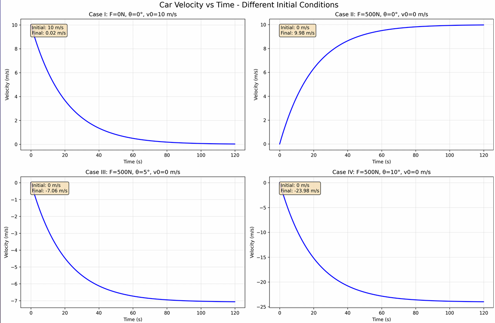
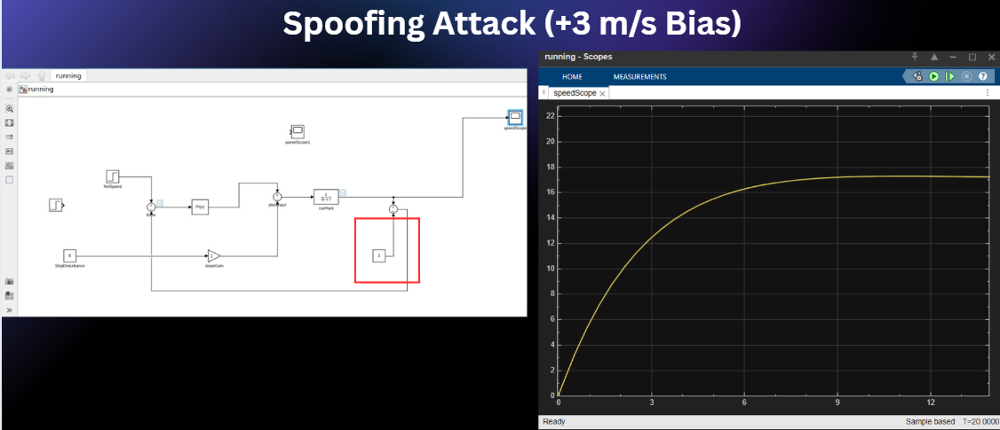

# ⚙️ Project 2 — Dynamic Car Cyber-Physical System Control & Security

## 📌 Project Overview
This project focuses on designing, modeling, and securing a **continuous-time dynamic car Cyber-Physical System (CPS)** using control engineering and cybersecurity principles.

The project integrates:
- Vehicle dynamic modeling
- P and PI controller design
- MATLAB / Simulink CPS simulation
- Performance evaluation metrics
- Cyber attack simulation and mitigation strategies

The goal was to analyze how controller design and cyber disturbances affect system stability, safety, and performance.

---

## 🎯 Project Objectives
- Model car longitudinal dynamics under friction and slope forces  
- Design and implement P and PI controllers  
- Evaluate controller performance under multiple road conditions  
- Implement full CPS closed-loop simulation in Simulink  
- Simulate cyber attacks on feedback control loop  
- Analyze system resilience and propose mitigations  

---

## 🚗 Dynamic Car Modeling

The vehicle was modeled as a continuous-time dynamic system affected by:
- Engine force
- Friction force
- Gravity (road slope disturbance)

Simulation cases showed:
- On flat road with no engine → vehicle stops due to friction  
- With constant engine force → vehicle reaches steady speed  
- On slopes → fixed force insufficient → controller required  

This demonstrates the need for adaptive control in CPS vehicle systems.

---

## 📊 Dynamic Car Simulation Cases

Multiple simulation scenarios were tested including:
- Flat road
- Constant slope road
- Variable slope road

These cases validate CPS plant behavior under environmental disturbances.

---

## 🧠 Controller Design (P and PI)

Controller structure:
- Error = Reference Speed − Actual Speed  
- P Controller → Fast response but steady-state error remains  
- PI Controller → Reduces steady-state error using integral term  

PI controller significantly improves tracking accuracy and long-term stability.

---

## 🖥 MATLAB / Simulink CPS Model

The full CPS closed-loop system was implemented in Simulink including:
- Car plant dynamics
- PI controller
- Feedback loop
- Slope disturbance input
- Actuator saturation limits

The model represents real CPS interaction between cyber controller and physical system.

---

## 📈 Performance Metrics Analysis

Performance evaluated using:

### Overshoot
Measures how much speed exceeds target before stabilizing.

### Settling Time
Time required to reach stable target speed band.

### Steady-State Error (SSE)
Difference between final speed and reference speed.

PI controller reduces SSE significantly compared to P controller.

---

## 🔁  Closed-Loop CPS Simulation Cases

Five simulation cases evaluated:
- Baseline control performance
- High gain aggressive control
- Low gain slow response
- Constant slope disturbance
- Time-varying slope disturbance

Results showed controller tuning directly impacts CPS stability and responsiveness.

---

## ⚠  Cyber Attack Simulation

### 🎯 Sensor Spoofing Attack

Attack injects false speed measurement:
- Controller reduces throttle incorrectly
- Final speed drops significantly
- Large steady-state error introduced

---

### ⏱ DoS Delay Attack

Attack introduces feedback delay:
- Causes large overshoot
- Increases settling time
- Creates temporary instability

These demonstrate how cyber attacks can degrade CPS physical performance.

---

## 🛡 Mitigation Strategies

### Against Sensor Spoofing
- Sensor fusion validation
- Redundant sensor systems
- Data anomaly detection
- Secure communication authentication

### Against DoS Delay
- Timestamp validation
- Watchdog timers
- Redundant communication links
- Predictive filtering (Kalman filtering)

---

## 🛠 Tools & Technologies
- MATLAB
- Simulink
- CPS Control System Modeling
- Control Engineering Theory
- Cyber-Physical Security Analysis

## 🔒 Note
Simulink model was developed and tested using MATLAB / Simulink environment.
