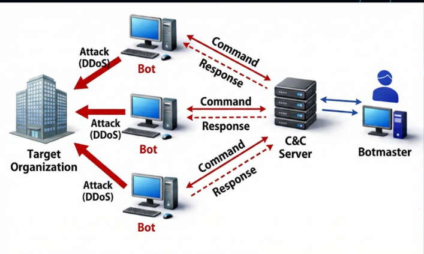
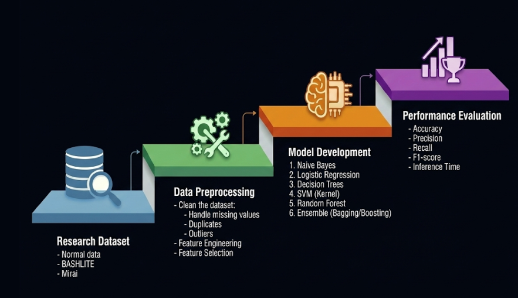
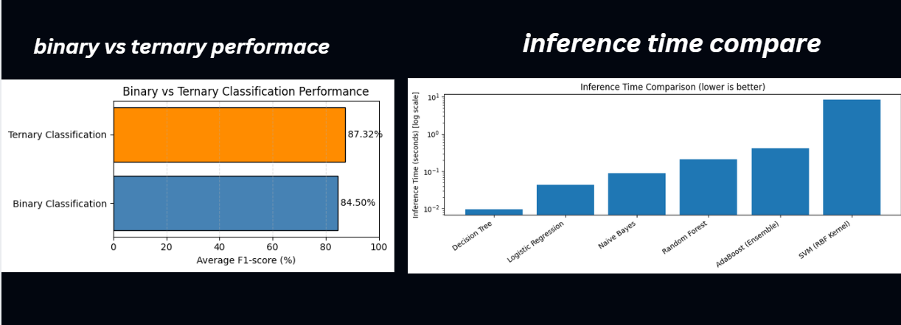
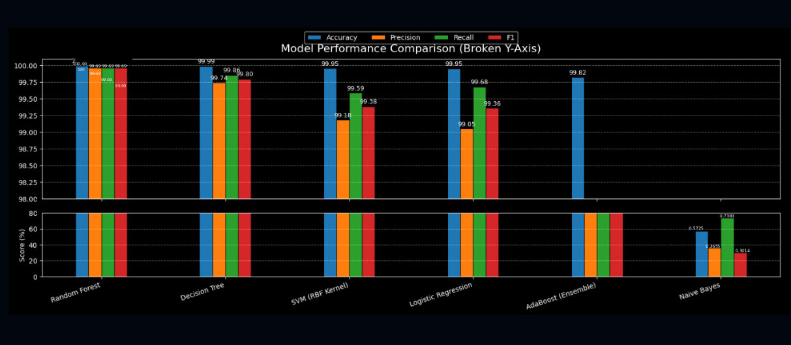
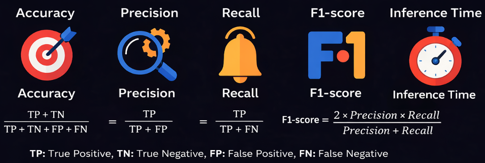

#  Project 3 — IoT Botnet Attack Detection Using Machine Learning

## 📌 Project Overview
This project focuses on detecting IoT botnet attacks using Machine Learning techniques applied to IoT network traffic data. The objective was to design an intelligent detection system capable of identifying malicious behavior in compromised IoT devices while maintaining high detection accuracy and low computational overhead.

The project was inspired by research on ensemble learning models for IoT botnet detection and implemented using the N-BaIoT dataset containing normal and malicious IoT network traffic.

The system evaluates multiple machine learning algorithms and compares their performance under different classification scenarios including binary and ternary classification.

---

## 🎯 Project Objectives
- Detect botnet attacks in IoT network traffic  
- Compare multiple ML classification algorithms  
- Evaluate model performance using standard ML metrics  
- Implement binary and multi-class (ternary) classification  
- Analyze IoT security risks and attack behaviors  
- Design ML-based detection pipeline for CPS / IoT environments  

---

## 🌐 IoT Botnet Security Context
IoT devices are resource-constrained systems with limited processing power, memory, and security mechanisms. This makes them vulnerable to botnet infections such as Mirai and Bashlite.

Botnets consist of:
- Infected IoT devices (Bots / Zombies)  
- Command & Control (C2) Server  
- Botmaster (Attacker Controller)  

These attacks allow attackers to remotely control devices, steal data, or launch distributed attacks.

The detection system must therefore identify abnormal traffic behavior patterns instead of relying only on signature-based detection. :contentReference[oaicite:0]{index=0}

---

## 📊 Dataset — N-BaIoT
The project used the N-BaIoT dataset which includes network traffic from multiple IoT devices under normal and botnet attack conditions.

### IoT Devices Included
- Doorbell  
- Thermostat  
- Baby Monitor  
- Security Camera  
- Webcam  

These devices provide realistic IoT network behavior for ML training and testing.

---

## 🖼 Dataset Device Context

---

## 🧠 Machine Learning Models Used

The following ML models were evaluated:
- Random Forest  
- Decision Tree  
- Support Vector Machine (SVM)  
- Logistic Regression  
- Naive Bayes  
- AdaBoost  

Ensemble learning techniques were also studied to improve detection performance and handle imbalanced datasets. :contentReference[oaicite:1]{index=1}

---

## ⚙ ML Detection Pipeline

The ML pipeline follows three main phases:

### 1️⃣ Data Preparation (DP)
- Data cleaning  
- Duplicate removal  
- Feature selection  
- Data normalization  
- Dataset splitting  

### 2️⃣ Learning Process (LP)
- Training ML models  
- Validation testing  
- Model parameter tuning  

### 3️⃣ Evaluation Process (EP)
- Performance measurement  
- Confusion matrix analysis  
- Accuracy, Precision, Recall, F1 Score  

---

## 📈 Binary vs Ternary Classification

Two classification approaches were implemented:

### Binary Classification
- Normal vs Attack  

### Ternary Classification
- Normal  
- Mirai Botnet  
- Bashlite Botnet  

This improves detection granularity and attack classification accuracy.

---

## 📊 Model Performance Comparison

The models were compared based on:
- Detection Accuracy  
- Precision  
- Recall  
- F1 Score  
- Prediction Speed  

Ensemble and tree-based models demonstrated strong detection capability across IoT traffic patterns.

---

## 🧪 Testing & Evaluation Metrics

Evaluation metrics included:

### Accuracy
Overall detection correctness.

### Precision
Measures false positive control.

### Recall (Sensitivity)
Measures detection capability for attacks.

### F1 Score
Balances precision and recall.

High detection accuracy (up to ~99%) demonstrates strong model performance for IoT botnet detection. :contentReference[oaicite:2]{index=2}

---

## 🔐 Security Impact
This ML-based detection approach enables:
- Early detection of IoT botnet infections  
- Real-time anomaly detection  
- Lightweight deployment suitable for IoT gateways  
- Improved CPS and IoT network resilience  

---

## 🛠 Tools & Technologies
- Python  
- Machine Learning Libraries (Scikit-learn, etc.)  
- Google Colab (Development Environment)  
- Data Preprocessing and Feature Engineering Techniques  

---

## 🔒 Note
Implementation was performed in a cloud-based notebook environment. The repository focuses on methodology, evaluation results, and system design rather than full code distribution.
